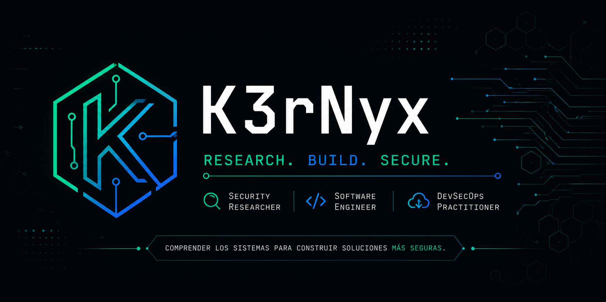
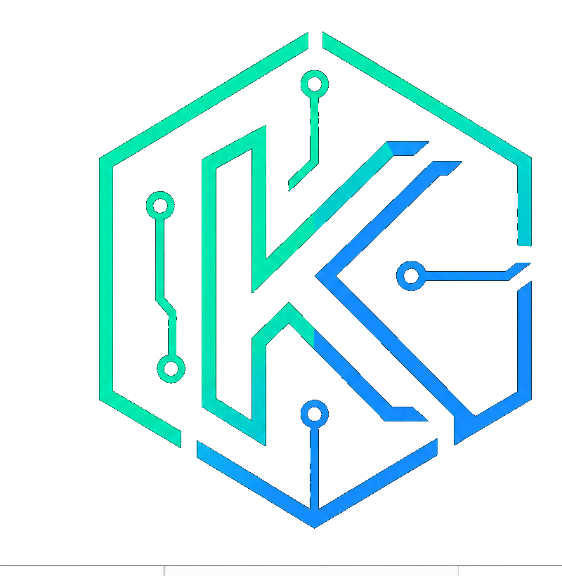

  

# K3rNyx

### Research. Build. Secure.

**Investigador de Seguridad • Ingeniero de Software • DevSecOps**

---

*"Comprender los sistemas para construir soluciones más seguras."*

---

# 👋 Bienvenido

Soy un apasionado por la ingeniería de software, la investigación en seguridad y el desarrollo de herramientas que permitan comprender mejor el funcionamiento de los sistemas.

Mi objetivo es aprender continuamente, compartir conocimiento y desarrollar soluciones útiles aplicando buenas prácticas de ingeniería y seguridad.

---

# 🎯 Áreas de interés

- Seguridad Informática
- Ingeniería de Software
- Linux
- DevSecOps
- Automatización
- Seguridad Web
- Infraestructura
- Contenedores
- Código Abierto

---

# 🚀 Actualmente aprendiendo

- Seguridad de aplicaciones
- Docker y Kubernetes
- Terraform
- CI/CD Seguro
- Arquitectura de Sistemas
- Desarrollo de herramientas en Python y Go

---

# 🛠️ Tecnologías

### Lenguajes

- Python
- Go
- Bash
- JavaScript
- SQL

### Herramientas

- Linux
- Git
- Docker
- GitHub Actions
- Kubernetes
- Terraform
- VS Code

---

# 📂 Proyectos

Próximamente encontrarás aquí:

- Herramientas de automatización
- Laboratorios de seguridad
- Investigación técnica
- Scripts
- Notas de estudio
- Proyectos Open Source

---

# 📖 Filosofía

> La seguridad no consiste en romper sistemas.
>
> Consiste en comprenderlos.
>
> Analizar.
>
> Construir.
>
> Mejorar.

---

## Think in Systems.

### Challenge Assumptions.

### Build Responsibly.

**— K3rNyx**

